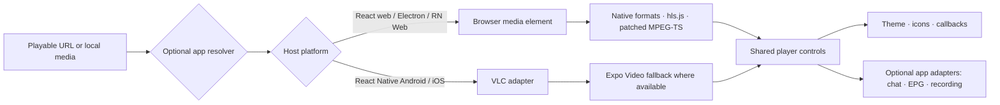

<p align="center">
  
</p>

<p align="center">
  <a href="https://github.com/nahushr/cinecrew-player/actions"></a>
  <a href="https://www.npmjs.com/package/@cinecrew/cinecrew-player"></a>
</p>

<h3 align="center">One player layer. Your app. Every screen.</h3>

<p align="center">
  A customizable playback experience for <strong>React</strong>, <strong>React Native</strong>, and <strong>Electron</strong>—from on-demand movies to Live TV previews, with the controls and integrations your product needs.
</p>

<p align="center">
  
  
  
  <a href="LICENSE"></a>
</p>

<p align="center"><a href="#install">Install</a> · <a href="#feature-portfolio">Features</a> · <a href="#platform--playback-matrix">Platforms</a> · <a href="#props">API reference</a> · <a href="#roadmap">Roadmap</a></p>

<p align="center"><strong>🎬 Movies</strong> &nbsp; <strong>📡 Live TV</strong> &nbsp; <strong>📱 Native</strong> &nbsp; <strong>🖥️ Web & Electron</strong></p>

| **2 player components** | **5 target environments** | **16 visibility controls** | **20 action hooks** |
|:---:|:---:|:---:|:---:|
| Full player + inline live preview | Web · Electron · Android · iOS · React Native Web | Choose what appears | Override default actions |

> **The product promise:** use ready-to-play defaults first; customize the interface, playback actions, and app-service adapters only where your product needs them.

## Playback at a glance



<p align="center"><sub>CineCrew Player handles the player surface and platform playback path. Your app remains in charge of authorization, link resolution, CORS, and service backends.</sub></p>

## Feature portfolio

| Area | Included capabilities | Designed for |
|---|---|---|
| 🎞️ **Playback** | On-demand and live media; URLs and local URIs; HLS and MPEG-TS paths on web; native VLC path; embedded YouTube playback | Movies, episodes, trailers, and channels |
| 🎛️ **Player controls** | Play/pause, seek, restart, mute, aspect ratio, lock, video-only/audio-only modes, audio tracks, playback speed, fullscreen, back, minimize | A complete control surface without hard-wiring your app navigation |
| 🎨 **Branding** | Theme colors, radius, platform styles, replaceable icons, custom panel render slots | Match your app without forking the player |
| 📡 **Live TV extensions** | Inline preview component; optional chat and EPG panels; recording adapter hooks | Channel browsing and live-viewing workflows |
| 🔌 **App integration** | Per-action callbacks, imperative ref API, source resolver, progress/presence/events hooks, sleep timer callback | Keep account, IPTV, analytics, and storage logic in your app |
| 🧭 **Playback lifecycle** | Ready, playing, buffering, progress, ended, error, fullscreen, next-episode, and playback-route callbacks | App-owned navigation, telemetry, and resume state |

<details>
<summary><strong>🎛️ Control inventory — all 16 visibility switches</strong></summary>

| Icon | `controls` key | What it controls | Notes |
|:---:|---|---|---|
| ↩️ | `back` | Back / close | Can be owned by app navigation |
| ▶️ | `playPause` | Play / pause | Center playback action |
| 🔁 | `restart` | Restart | Primarily useful for on-demand media |
| 🔒 | `lock` | Lock / unlock controls | Prevent accidental touches |
| 🔊 | `mute` | Mute / unmute | Volume prop also sets initial level |
| 🖼️ | `aspectRatio` | Fit / fill / stretch | Available choices depend on renderer |
| 🔇 | `videoOnly` | Video-only mode | Keeps video presentation while muting audio |
| 🎧 | `audioOnly` | Audio-only presentation | Playback continues behind the audio card |
| 🎚️ | `audioTracks` | Audio-track selection | Depends on exposed tracks / platform engine |
| ⏩ | `playbackRate` | Playback speed | On-demand experience |
| ⤵️ | `minimize` | Minimize action | App supplies its navigation or sheet behavior |
| ⛶ | `fullscreen` | Fullscreen / promote preview | Native full-player presentation is platform-specific |
| ⏺️ | `recording` | Recording controls | Requires an app recording adapter or callback |
| 💬 | `liveChat` | Live chat panel | Requires an adapter, render slot, or callback |
| 📅 | `epg` | Electronic program guide | Requires an adapter, render slot, or callback |
| ⏱️ | `seek` | Seek bar | Meaningful for seekable media |

</details>

<details>
<summary><strong>🧩 Customization inventory</strong></summary>

| Customize | How |
|---|---|
| 🎨 Colors and shape | `theme`: accent, background, control, surface, error colors, border radius, and native palette |
| 🪄 Icons | `icons`: provide a glyph/string, React node, or icon component; omitted icons keep CineCrew defaults |
| 🧠 Per-control behavior | `actions`: override only the actions your app wants to own; built-in behavior remains the default otherwise |
| 🧱 App-owned panels | `renderLiveChat`, `renderEpg`, or integration render callbacks |
| 🔗 Source handling | `resolveSource` for share pages or host-specific resolution; direct media sources pass through unchanged |
| 📐 Layout | `style`, web `className`, inline preview geometry, and `InlineLivePlayer` height |
| 📣 Events and state | Lifecycle callbacks plus progress, presence, analytics, and sleep-timer integrations |

</details>

## Platform & playback matrix

| Host | Public entry | Rendering / engine path | Key considerations |
|---|---|---|---|
| 🌐 React in browser | `@cinecrew/cinecrew-player` or `@cinecrew/cinecrew-player/react` | DOM player; browser media, hls.js, patched mpegts.js; YouTube embed | Browser codec support and origin CORS still apply |
| 🖥️ Electron | `@cinecrew/cinecrew-player/electron` | Same web renderer inside Electron Chromium | Chromium’s codec and network rules still apply |
| 🤖 React Native Android | `@cinecrew/cinecrew-player/native` or `@cinecrew/cinecrew-player/react-native` | Native React Native surface with bundled VLC adapter; Expo Video fallback where available | Native dependencies must be compiled into the app |
| 📱 React Native iOS | `@cinecrew/cinecrew-player/native` or `@cinecrew/cinecrew-player/react-native` | Native React Native surface with bundled VLC adapter; Expo Video fallback where available | Native dependencies must be compiled into the app |
| 🧪 React Native Web / Expo Web | `@cinecrew/cinecrew-player/react-native-web` | Browser renderer from a React Native Web host | Uses web media paths, not native VLC |

| Media / source | Web & Electron | React Native | What the app may need to provide |
|---|---|---|---|
| MP4 / browser-native media | ✅ Browser media element | ✅ Native engine | A directly playable URL or local URI |
| HLS (`.m3u8`) | ✅ hls.js / native HLS where available | ✅ Native engine | Origin access, valid playlist/segments, compatible codecs |
| MPEG-TS (`.ts`) | ✅ Bundled patched MPEG-TS client, when browser conditions permit | ✅ VLC path | Browser codecs and CORS; native module availability |
| YouTube watch / Shorts / `youtu.be` | ✅ Embedded YouTube player | ✅ Embedded native WebView | Video must allow embedding; network access to YouTube |
| Local files | ✅ Platform-supported local/blob URI | ✅ Platform-supported file URI | App obtains and passes the platform-readable URI |
| Share pages / cloud-drive pages | ⚙️ Optional `resolveSource` | ⚙️ Optional `resolveSource` | Your app resolves authentication and obtains a playable media URL |

**Compatibility is not a promise that every URL plays everywhere.** A browser needs a compatible container/codec and any required CORS permission. Arbitrary web pages are not necessarily media files. For known browser-incompatible MPEG-TS audio such as AC3, use native playback when supported or handle the browser error in the consuming app.

## Tech stack

| Layer | Technologies in this package |
|---|---|
| UI & API | React · React Native · TypeScript declarations |
| Web playback | HTML video · hls.js · patched mpegts.js · YouTube IFrame API |
| Native playback | VLC adapter bundled in `@cinecrew/cinecrew-player` · `expo-video` fallback |
| Native UI / utilities | React Native · Expo config plugins · safe-area context · SVG · community slider |
| Optional media utilities | Mediabunny / AC3 parsing support in relevant web playback paths |
| Packaging | Platform-specific entry points · npm exports · bundled styles · native autolinking |

## Why this can be the player layer for a movie or IPTV app

| Your app owns | CineCrew Player supplies |
|---|---|
| 🔐 User accounts, subscriptions, authorization, and provider credentials | 🎛️ Shared player UI and default controls |
| 🔗 Turning provider/share links into playable sources; CORS and networking policy | 🔀 Platform-aware browser/native playback adapters |
| 💬 Chat service, 📅 EPG service, and ⏺️ recording implementation | 🧩 Integration surfaces and optional built-in presentation |
| 🗃️ Catalog, favorites, watch history, and backend storage | 🎨 Customizable theme, icons, control visibility, callbacks, and lifecycle events |

**The result:** one player integration can serve movie and Live TV product flows across web, Electron, and native mobile, while provider-specific and account-specific code stays in the host app.

> CineCrew Player is a playback component—not an IPTV service, media relay, DRM system, or universal URL-to-video converter. The package does not require a CineCrew account, worker, backend, or proxy.

## Roadmap

The items below are planned for more consistent, user-facing support across platforms. Some playback engines may already expose related low-level capabilities.

| Status | Planned feature |
|:---:|---|
| [ ] | ☀️ Cross-platform brightness control |
| [ ] | 🔉 In-player volume slider (in addition to mute / unmute) |
| [ ] | ✨ AI-generated subtitles |
| [ ] | 🎧 Broader client-side audio demuxing across codecs and stream types |
| [ ] | 🪟 Consistent picture-in-picture controls across platforms |

[](https://stackblitz.com/fork/github/nahushr/cinecrew-player/tree/main/examples/web-demo?startScript=dev)

## Demos

- **[React + Vite web demo](examples/web-demo)** — try YouTube, MPEG-TS, MP4, MKV, or a local video file. Switch between the full player (all controls and demo chat/EPG/recording adapters enabled) and the compact inline player. [Open a fresh StackBlitz copy](https://stackblitz.com/fork/github/nahushr/cinecrew-player/tree/main/examples/web-demo?startScript=dev).
- **[Expo / React Native Web demo](examples/expo-web-demo)** — the same source tests and controls in an Expo app rendered for the web.

Both demos use the single package in this repository (`file:../..`) so they can build before and after the public release. The React DOM entry resolves to the browser renderer; it does not evaluate React Native or VLC code. The Expo native entry bundles VLC into the same installed package. External media hosts must allow browser CORS requests; format/codec support also depends on the browser. MKV playback is generally more reliable through the native VLC adapter than a browser video element.

Run either demo:

```sh
cd examples/web-demo
npm install
npm run dev
```

```sh
cd examples/expo-web-demo
npm install
npm run web
```

> Direct media sources are passed through to the platform engine. A page/share URL is not necessarily a playable media source; use `resolveSource` to resolve it. The player does not rewrite protocols, proxy media, or impose host-specific CORS rules.

## Install

Install the player from the public npm registry:

```sh
npm install @cinecrew/cinecrew-player
```

React is the shared peer dependency. Native React Native builds use the VLC adapter bundled in this package plus the `expo-video` fallback; native code is autolinked and compiled into the app binary. Plain React web consumers use the browser entry and do not execute or compile the bundled Android/iOS source.

### Supported targets and entry points

The package has one public player API with a renderer selected for the host. The React DOM/Electron entry has no React Native renderer or WebView import; bundled Android/iOS files are only compiled when a React Native host selects the native entry and autolinks the native module.

| Host app | Import | Renderer / playback |
| --- | --- | --- |
| React DOM in a browser | `@cinecrew/cinecrew-player` or `@cinecrew/cinecrew-player/react` | HTML video, hls.js, patched mpegts.js, and the browser YouTube embed. |
| React DOM inside Electron (macOS `.dmg`, Windows `.exe`) | `@cinecrew/cinecrew-player/electron` | Same renderer as React web, using Electron's Chromium media stack. No WebView or custom Electron IPC bridge is needed. |
| React Native Android / iOS | `@cinecrew/cinecrew-player` or `@cinecrew/cinecrew-player/react-native` | React Native UI with the bundled VLC adapter and Expo video fallback; YouTube uses `react-native-webview`. |
| React Native Web / Expo Web | `@cinecrew/cinecrew-player` or `@cinecrew/cinecrew-player/react-native-web` | React DOM adapter hosted inside the React Native Web app; uses browser playback engines and does not load native VLC or WebView code. |

Metro selects the React Native entry for native builds; regular React bundlers select the React DOM entry. The explicit subpaths let you pin the renderer when preferred.

### React Native / Expo

```tsx
import CineCrewPlayer from '@cinecrew/cinecrew-player/native';

export function WatchScreen() {
  return (
    <CineCrewPlayer
      source={{ uri: 'https://media.example.com/live/channel.m3u8', isLive: true }}
      title="Example channel"
      controls={{ liveChat: false, epg: false, recording: false }}
    />
  );
}
```

For an Expo prebuild project, add the CineCrew Player config plugin and rebuild the native app (a JavaScript reload cannot add a native module). The VLC native implementation ships inside this same package; there is no second VLC package to install. `react-native-webview` is used only as the native YouTube embed surface; regular native streams use VLC / `expo-video`. Browser and Electron YouTube playback use the YouTube IFrame API instead.

```json
{
  "expo": {
    "plugins": ["@cinecrew/cinecrew-player"]
  }
}
```

Then run `npx expo prebuild` as appropriate for your project and rebuild/install the development or production client. Expo Go does not contain the VLC native module; the player uses its `expo-video` fallback where available. In bare React Native projects, install the native dependencies, run CocoaPods on iOS, and rebuild the app.

The component opens the native player as a full-screen player. To show a compact live preview in a channel list, use the companion component:

```tsx
import { InlineLivePlayer } from '@cinecrew/cinecrew-player/native';

<InlineLivePlayer
  url={channelUrl}
  title="Example channel"
  height={220}
  isActive={selected}
  paused={!selected}
  onFullscreen={() => openFullPlayer(channelUrl)}
/>
```

The web entry exports the same compact preview component:

```tsx
import { InlineLivePlayer } from '@cinecrew/cinecrew-player/web';
import '@cinecrew/cinecrew-player/styles.css';

<InlineLivePlayer
  source={{ uri: channelUrl, isLive: true }}
  title="Example channel"
  isActive={selected}
  paused={!selected}
  onFullscreen={() => openFullPlayer(channelUrl)}
/>
```

### React (web)

```tsx
import CineCrewPlayer from '@cinecrew/cinecrew-player';
import '@cinecrew/cinecrew-player/styles.css';

export function WatchScreen() {
  return (
    <CineCrewPlayer
      source={{ uri: 'https://media.example.com/live/channel.m3u8', isLive: true }}
      title="Example channel"
      autoPlay
      theme={{ accentColor: '#35d7ff', borderRadius: 16 }}
    />
  );
}
```

Web playback is direct from the supplied URL. HLS and MPEG-TS clients fetch playlists and segments from the stream origin, so the origin must permit those browser requests.

### YouTube and share links

Pass a YouTube watch, Shorts, or `youtu.be` URL as the source to play it inside the player rather than opening another app:

```tsx
<CineCrewPlayer source="https://www.youtube.com/watch?v=dQw4w9WgXcQ" title="Trailer" />
```

The video must allow embedding. Other URLs are passed unchanged to the platform engine. A Google Drive/share page or other webpage is not itself a media stream; resolve it in your app and provide the playable URL, or use the optional `resolveSource` callback. This keeps provider authentication, CORS policy, and URL extraction under the consuming app’s control.

```tsx
<CineCrewPlayer
  source={{ uri: driveShareUrl, title: 'My video' }}
  resolveSource={async (source, { platform }) => ({
    ...source,
    uri: await resolveMyDriveMediaUrl(source.uri, platform),
  })}
/>
```

## Media support

| Platform | Playback path | Notes |
| --- | --- | --- |
| Web | Native `<video>`, hls.js, and the bundled patched mpegts.js client | MP4 and browser-native formats, HLS (`.m3u8`), and MPEG-TS (`.ts`) when the stream, codecs, and CORS policy permit it. |
| React Native Android / iOS | VLC native module; `expo-video` fallback when VLC is unavailable | VLC supports a broader range of containers/codecs, including common AC3 streams. Native module availability depends on the app binary. |
| Electron renderer | Chromium `<video>`, hls.js, and patched mpegts.js | Same browser codec/CORS constraints as React web; packages with the app's `.dmg` / `.exe`. |

Browser codec support varies. The web player reports an AC3 compatibility message only when its MPEG-TS probe identifies unsupported AC3 audio; native playback does not apply this browser-only restriction. YouTube sources use the embedded YouTube player and remain subject to the video’s embed settings.

## How CineCrew Player differs from established players

This is a comparison of each project’s **documented focus and out-of-the-box integration surface**, not a claim that another library cannot be extended to do these things. HLS, YouTube playback, custom styling, and player controls are established capabilities in this space—not unique CineCrew claims.

| Player | Documented focus | Where CineCrew’s focus differs |
| --- | --- | --- |
| [Vidstack](https://vidstack.io/docs/player/) | A feature-rich **web** media framework with React and Web Component APIs, customizable/headless components, production layouts, and providers including HLS, DASH, YouTube, and Vimeo. | CineCrew packages web playback together with a React Native renderer for Android/iOS, an Electron web entry, and adapter slots for app-owned IPTV services. |
| [Video.js](https://github.com/videojs/video.js/) | A mature **web-based HTML5 player** supporting common web media and streaming formats such as HLS/DASH, with a broad plugin ecosystem. | CineCrew’s package-level scope also includes native React Native playback and app-oriented control/integration props, rather than being centered on the browser player ecosystem. |
| [React Native Video](https://docs.thewidlarzgroup.com/react-native-video/docs/v7/fundamentals/intro/) | A **React Native playback library** for native platforms. Its v7 documentation describes a player/view split; its view API includes native controls and a PiP option where supported. | CineCrew combines native playback with its own customizable player shell and web/Electron renderers, and documents optional live-chat, EPG, and recording adapters. |

In short: CineCrew’s intended distinction is **one app-facing player package for movie and IPTV product flows across web and native mobile**, with Electron support and app-owned service adapters. Vidstack and Video.js have more mature, broader web ecosystems; React Native Video is a strong native playback option. CineCrew is not claiming to replace every specialized player or to have feature parity with those ecosystems.

## Props

`CineCrewPlayer` accepts the following common props. `source` can be a URL string or an object; `url` is a convenience alias.

| Prop | Type | Default | Description |
| --- | --- | --- | --- |
| `source` | `string \| PlayerSource` | — | Media URL and optional metadata. `uri` and `url` are accepted. |
| `url` | `string` | — | Alias for `source`. |
| `title` | `string` | `source.title \| ''` | Display title. |
| `poster` / `posterUrl` | `string` | `source.posterUrl` | Poster displayed where supported and in audio-only mode. |
| `mediaType` | `string` | inferred | For example `live`, `movie`, or `series`. |
| `isLive` | `boolean` | `source.isLive \| false` | Marks a live source. |
| `visible` | `boolean` | URL present | Show or hide the native player. |
| `autoPlay` | `boolean` | `true` | Start playback automatically. Browser autoplay policies may still require muted playback or a user gesture. |
| `paused` | `boolean` | `!autoPlay` | Initial paused state; web also observes changes. |
| `muted` | `boolean` | `false` | Initial mute state. |
| `volume` | `number` | `1` | Initial volume from `0` to `1`. |
| `playbackRate` | `number` | `1` | Initial playback speed; the on-demand speed control can change it afterward. |
| `controls` | `PlayerControls` | defaults below | Show/hide individual control buttons. |
| `actions` | `PlayerActions` | `{}` | Replace the built-in behavior for individual actions. If a callback is provided, that callback owns the action. |
| `integrations` | `PlayerIntegrations` | `{}` | Inject user identity, chat, EPG, recording, analytics, and presence services. |
| `theme` | `PlayerTheme` | built-in theme | Customize player colors, borders, and shape. |
| `icons` | `PlayerIcons` | built-in icons | Override any control icon by key. |
| `style` | platform style | — | Outer player style. On web this is a CSS style object; native uses React Native style props. |
| `className` | `string` | `''` | Web-only class name for the player root. |
| `videoOnly` | `boolean` | `false` | Start muted in video-only mode. |
| `audioOnly` | `boolean` | `false` | Start in audio-only presentation. Playback continues while the visual card is shown. |
| `resolveSource` | callback | — | Optional synchronous or asynchronous resolver for share pages and provider-specific links. Receives `{ uri, ...source }` and `{ platform }`; return a playable URL or `PlayerSource`. Without it, the original source is passed through unchanged. |
| `audioTracks` | `AudioTrack[]` | detected | Optional supplied track list (web). Native tracks are read from the native player. |
| `selectedAudioTrack` | `string \| number` | first/default track | Initial or preferred audio track. |
| `resumePosition` | `number` | `0` | Resume position in seconds for on-demand playback. |
| `durationSecs` | `number` | `0` | Known duration in seconds. |
| `mediaId`, `episodeLabel`, `season`, `episode`, `genre`, `categoryName` | metadata | — | Optional item metadata for the player and integrations. |
| `playlist` | `object[]` | — | Episode list used for automatic next-episode behavior. |
| `shuffle` | `boolean` | `false` | Select a random next episode when the current episode ends. |
| `onClose`, `onBack`, `onMinimize` | callbacks | — | Player lifecycle/navigation callbacks. |
| `onReady`, `onProgress`, `onPlaying`, `onBuffering`, `onError`, `onEnded`, `onPlaybackRoute` | callbacks | — | Playback lifecycle callbacks. Progress payloads are platform-specific native/browser events. |
| `onNextEpisode`, `onCwRefresh` | callbacks | — | Episode advancement and post-close refresh hooks. |
| `renderLiveChat`, `renderEpg` | render functions | — | Web custom-panel render slots. On native, use the chat/EPG integration adapters. |
| `initialShowLiveChat`, `liveChatNonce` | `boolean`, `number` | `false`, `0` | Open or re-open the live-chat panel (when available). |
| `inlinePreview`, `inlinePreviewRect`, `onInlinePreviewWheel`, `onPromotePreview`, `onPlayerHostRef` | preview options and callbacks | — | Embed/manage the player as a movable inline preview. Mainly useful for app-level player shells. |

`features` can enable optional diagnostics with `{ diagnostics: true }`. `onFullscreen` receives `{ isFullscreen }`. All lifecycle callbacks in the table are optional; native event objects differ from browser events.

### Player source

```ts
type PlayerSource = string | {
  uri?: string;
  url?: string;
  title?: string;
  poster?: string;
  posterUrl?: string;
  id?: string | number;
  streamId?: string | number;
  mediaId?: string | number;
  type?: string;       // e.g. 'mpegts', 'hls', or 'youtube' when paired with a YouTube video ID
  mimeType?: string;
  mediaType?: string;
  isLive?: boolean;
};
```

### Inline live preview props

`InlineLivePlayer` is exported from `@cinecrew/cinecrew-player/native` and `@cinecrew/cinecrew-player/web`. It renders a compact channel preview/poster and can promote playback to the host app's full player.

| Prop | Type | Default | Description |
| --- | --- | --- | --- |
| `source`, `url` | `string \| PlayerSource` | — | Direct channel URL and optional channel metadata. |
| `title` | `string` | `Live TV` | Channel title shown in the preview. |
| `height` | `number` | `220` | Inline preview height. |
| `poster`, `posterChannel` | string / object | — | Still image or channel object used when preview is paused/inactive. |
| `paused`, `isActive` | `boolean` | `false`, `true` | Control whether this preview should render/play its stream. |
| `onActivate` | `() => void` | — | Called when an inactive preview poster is selected. |
| `onFullscreen` | `() => void` | — | Called to promote/open the full player. |
| `controls` | `Pick<PlayerControls, 'playPause' \| 'mute' \| 'fullscreen'>` | all shown | Toggle its compact controls. |
| `actions` | matching `PlayerActions` subset | built-in | Replace play/pause, mute, or promote behavior. |
| `initialMuted` | `boolean` | `true` | Initial preview mute state. |
| `theme`, `icons`, `style` | `PlayerTheme`, `PlayerIcons`, platform style | defaults | Customize preview colors, controls, and layout. |
| `onError`, `onPlaying` | callbacks | — | Playback lifecycle callbacks. |

## Control visibility

Every control can be hidden with `false`. Defaults are designed to be useful out of the box; adapter-backed controls appear when their adapter or corresponding action callback is supplied.

```tsx
<CineCrewPlayer
  source={source}
  controls={{
    back: true,
    playPause: true,
    restart: true,
    lock: true,
    mute: true,
    aspectRatio: true,
    videoOnly: false,
    audioOnly: true,
    audioTracks: true,
    playbackRate: true,
    minimize: false,
    fullscreen: true,
    recording: false,
    liveChat: false,
    epg: false,
    seek: true,
  }}
/>
```

| Control key | Description |
| --- | --- |
| `back` | Back/close button. Native hardware back remains available. |
| `playPause` | Center play/pause control. |
| `restart` | Restart on-demand media. |
| `lock` | Lock/unlock touch controls. |
| `mute` | Mute/unmute. |
| `aspectRatio` | Fit/fill/stretch and available aspect choices. |
| `videoOnly` | Mute audio while keeping video visible. |
| `audioOnly` | Show the audio-only card while playback continues. |
| `audioTracks` | Audio-track picker when tracks are exposed. |
| `playbackRate` | On-demand playback speed. |
| `minimize` | Minimize callback button; hidden unless enabled. |
| `fullscreen` | Fullscreen button on web and inline previews. Native player opens full-screen. |
| `recording` | Recording controls; requires `integrations.recording` or an action override. |
| `liveChat` | Chat drawer/panel; requires a chat adapter, render slot, or action override. |
| `epg` | EPG drawer/panel; requires an EPG adapter, render slot, or action override. |
| `seek` | On-demand seek bar. |

## Actions and callbacks

Callbacks passed to `actions` **replace** built-in behavior; this is useful when an app wants to own navigation, playback state, or a control. Each receives an action payload and a context with the imperative `player` API (and the web video element where available).

```tsx
const playerRef = React.useRef(null);

<CineCrewPlayer
  ref={playerRef}
  source={source}
  actions={{
    onRestart: (_payload, { player }) => player?.restart(),
    onMinimize: () => closePlayerSheet(),
    onBack: () => navigation.goBack(),
    onMute: ({ muted }, { player }) => player?.setMuted(muted),
    onAspectRatioChange: ({ aspectRatio }, { player }) => player?.setAspectRatio(aspectRatio),
  }}
/>
```

Available action keys: `onBack`, `onPlayPause`, `onSeek`, `onRestart`, `onLock`, `onMute`, `onAspectRatioChange`, `onVideoOnlyChange`, `onAudioOnlyChange`, `onAudioTrackChange`, `onMinimize`, `onPlaybackRateChange`, `onFullscreen`, `onRecordingStart`, `onRecordingPause`, `onRecordingResume`, `onRecordingStop`, `onLiveChatOpen`, `onEpgOpen`, and `onDiagnosticsOpen`.

The ref exposes `play`, `pause`, `togglePlayPause`, `restart`, `setMuted`, `toggleMute`, `setAspectRatio`, `setAudioTrack`, `setAudioOnly`, `setVideoOnly`, `setPlaybackRate`, `seekTo`, `seekBy`, `back`, `minimize`, `getVideoElement`, `getAudioTracks`, and fullscreen methods where supported.

## Integrations

Integrations are optional. The package has no CineCrew account, database, or worker dependency; the consuming app supplies its own functions.

```tsx
<CineCrewPlayer
  source={source}
  mediaId={channel.id}
  integrations={{
    user: { id: currentUser.id, username: currentUser.name },
    liveChat: {
      pollIntervalMs: 5000,
      loadMessages: ({ channelId, limit }) => api.loadChat(channelId, limit),
      sendMessage: ({ channelId, userId, username, comment }) =>
        api.sendChat({ channelId, userId, username, comment }),
    },
    epg: {
      limit: 48,
      loadListings: ({ channelId, limit }) => api.getEpg(channelId, limit),
    },
    recording: {
      start: ({ getVideoElement, streamUrl, title }) => recorder.start({ getVideoElement, streamUrl, title }),
      pause: () => recorder.pause(),
      resume: () => recorder.resume(),
      stop: () => recorder.stop(),
      isActive: () => recorder.isActive(),
      subscribe: (listener) => recorder.subscribe(listener),
    },
    onEvent: ({ name, payload }) => analytics.track(name, payload),
    onProgress: (progress) => saveProgress(progress),
    onPresence: (presence) => updatePresence(presence),
    onSleepTimerExpired: (close) => sleepTimer.onExpired(close),
  }}
/>
```

`loadMessages` returns an array of messages with `username` and `comment` (or `message`) fields. `loadListings` returns EPG entries with `startMs` and `endMs` epoch-millisecond timestamps. The native player renders the built-in chat and EPG UI from these adapters. On web, an app can use `renderLiveChat` / `renderEpg`, or provide `integrations.liveChat.render` / `integrations.epg.render`.

## Themes and icons

Defaults are used unless the caller supplies an override. Web theme properties include `accentColor`, `backgroundColor`, `controlBackground`, `controlColor`, `surfaceColor`, `errorColor`, and `borderRadius`. Native also accepts a `colors` palette object.

```tsx
<CineCrewPlayer
  source={source}
  theme={{
    accentColor: '#16c7d9',
    backgroundColor: '#07111e',
    surfaceColor: '#101e30',
    controlColor: '#f8fbff',
    borderRadius: 18,
  }}
  icons={{
    play: <MyPlayIcon />,
    pause: <MyPauseIcon />,
    mute: 'volume-mute',
    fullscreen: ({ color, size }) => <MyFullscreenIcon color={color} size={size} />,
  }}
/>
```

Icon keys: `play`, `pause`, `restart`, `lock`, `unlock`, `mute`, `unmute`, `aspectRatio`, `videoOnly`, `audio`, `minimize`, `back`, `recording`, `stop`, `liveChat`, `epg`, `fullscreen`, and `close`. A value may be a string/glyph, a React element, or an icon component.

## Sources and link resolution

Local file URIs and direct stream URLs are passed to the selected platform player without changing `http`, `https`, `file`, or other schemes. YouTube watch/share URLs are recognized and played with the embedded YouTube player. Other sharing pages (for example, a private Google Drive page) need a consumer-provided resolver because the package cannot access the consumer’s credentials or infer every host’s download rules:

```tsx
<CineCrewPlayer
  source={{ uri: driveShareUrl, title: 'My video' }}
  resolveSource={async (source, { platform }) => {
    const playableUrl = await myDriveService.getPlayableUrl(source.uri, platform);
    return { ...source, uri: playableUrl };
  }}
/>
```

The web browser still enforces its own media-format and origin policies. The player reports engine errors through `onError`; the consuming application decides how to resolve or present them.

## License and attribution

The player package is MIT-licensed. The native VLC module is an adapted upstream project and includes its license and notices. MPEG-TS playback uses the bundled patched `mpegts.js` distribution, retaining its Apache-2.0 license. See [`NOTICE`](NOTICE) and the included dependency licenses for details.

## Development

```sh
npm install
npm run check:types
npm test
npm pack --dry-run
```

The native VLC source and its Android/iOS autolinking configuration are included inside the `@cinecrew/cinecrew-player` package. The repository publishes only this player package; the adapter is not a separate npm package.
